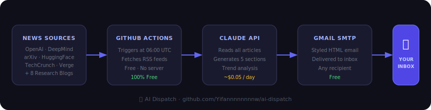

# 📡 AI Dispatch

**Your daily AI intelligence briefing, delivered to your inbox.**

Automatically aggregates the latest in AI, Robotics, and Agents every morning — analyzed by an LLM of your choice, delivered to your inbox. Runs entirely on GitHub Actions. No server. No subscription.



---

## What You Get

Every email contains five structured sections:

| Section | Content |
|---------|---------|
| 📌 Top Stories | 10–15 curated items, each with significance analysis and cross-story connections |
| 📈 Trend Analysis | Cross-article patterns with evidence and forward predictions |
| 🔬 Papers Worth Reading | Selected arXiv papers with core contributions and reading focus |
| 📖 Blog Pick | One deep-read recommendation (never repeats, auto-deduped) |
| 💡 Today's Signal | The one judgment that matters most today, in one sentence |

[View a sample email →](assets/demo_email_en.html)

---

## Quick Start

### Prerequisites

- GitHub account (free)
- Gmail account
- LLM API Key (default: Anthropic — pay-per-use, ~$0.05/day with Sonnet)

---

### Step 1 — Fork this repo

Click **Fork** in the top right → create it under your own account.

---

### Step 2 — Get a Gmail App Password

> Gmail requires an app-specific password, not your account password.

1. Go to [myaccount.google.com/security](https://myaccount.google.com/security)
2. Confirm **2-Step Verification** is enabled
3. Search for **App Passwords** → open it
4. Select Mail + Mac → click **Generate**
5. Copy the **16-character password** (shown only once)

---

### Step 3 — Add GitHub Secrets

Go to your forked repo → **Settings → Secrets and variables → Actions → New repository secret**

Add these **4 secrets**:

| Secret | Value |
|--------|-------|
| `ANTHROPIC_API_KEY` | Your LLM API key (default: Anthropic `sk-ant-...`) |
| `GMAIL_USER` | Your Gmail address |
| `GMAIL_APP_PASSWORD` | The 16-character app password (no spaces) |
| `RECIPIENT_EMAIL` | Destination inbox (can be same as `GMAIL_USER`) |

---

### Step 4 — Personalize `config.yml`

Edit `config.yml` in the repo root — it's the only file you need to touch:

```
config.yml has 5 sections:

  STEP 1 · Topics          → tell the model what you care about
  STEP 2 · News feeds      → comment out sources you don't want, add your own RSS
  STEP 3 · Blog feeds      → researcher blogs, auto-rotated over 90 days
  STEP 4 · Classics        → timeless articles/interviews, auto-deduped forever
  STEP 5 · Advanced        → model selection, language, token limits
```

**Example — change your topics:**
```yaml
topics:
  - computer vision
  - reinforcement learning
  - AI safety
```

**Example — add a classic article:**
```yaml
classics:
  - title: "Article Title"
    url: https://example.com/article
    author: Author Name
    type: blog        # blog / interview / talk / essay
    year: 2023
    note: One line on why it's worth reading
```

---

### Step 5 — Verify your setup

Go to **Actions → ✅ Check Setup → Run workflow**

This validates all configuration and sends a test email to your inbox:

```
── GitHub Secrets ──────────────────────────────────
  ✅  ANTHROPIC_API_KEY  (set)
  ✅  GMAIL_USER         (set)
  ✅  GMAIL_APP_PASSWORD (set)
  ✅  RECIPIENT_EMAIL    (set)

── config.yml ──────────────────────────────────────
  ✅  config.yml found
  ✅  topics configured  (3 topics)
  ✅  news_feeds configured  (9 sources)
  ✅  blog_feeds configured  (8 blogs)

── LLM API ──────────────────────────────────────────
  ✅  API connection successful

── Gmail SMTP ───────────────────────────────────────
  ✅  Gmail login successful (you@gmail.com)

── Test email ───────────────────────────────────────
  ✅  Test email sent (check your inbox)

══════════════════════════════════════════════════════
  🎉  All checks passed! Your daily digest starts tomorrow.
══════════════════════════════════════════════════════
```

Once all green, AI Dispatch runs automatically every day. The default send time targets **07:00 BST / 07:00 GMT** — to change it, edit `send_hour_utc` in `config.yml` (no workflow file changes needed).

---

## Cost

The LLM call is the only cost. GitHub Actions is always free.

**Default (Anthropic):**

| Model | Per day | Per month | Notes |
|-------|---------|-----------|-------|
| `claude-sonnet-4-6` | ~$0.05 | ~$1.50 | Default, great quality |
| `claude-opus-4-7` | ~$0.67 | ~$20 | Highest quality |

You can swap in any compatible model by editing `digest.model` in `config.yml` and updating `fetch_news.py` to use your preferred SDK.

---

## File Structure

```
ai-dispatch/
├── config.yml              ← Your personalization (the only file to edit)
├── fetch_news.py           ← Main pipeline
├── check_setup.py          ← Setup verification script
├── requirements.txt
├── sent_history.json       ← Auto-maintained dedup log (do not edit manually)
└── .github/workflows/
    ├── daily_news.yml      ← Daily cron job
    └── check_setup.yml     ← One-click setup check
```

---

## FAQ

**Q: Test email arrived but no daily digest?**
Check Actions → AI Dispatch for errors. GitHub Actions cron can occasionally delay 15–30 minutes.

**Q: Gmail login fails (SMTPAuthenticationError)?**
Make sure you're using the 16-character **app password**, not your Gmail account password.

**Q: How do I switch to English output?**
In `config.yml`, change `output_language: 中文` to `output_language: English`.

**Q: How do I add my own RSS sources?**
Add a line under `news_feeds` or `blog_feeds` in `config.yml`: `Source Name: https://rss-url`.

**Q: Blog picks keep repeating?**
`sent_history.json` tracks all previously sent URLs. To reset, clear the `urls` array in that file.

---

---

# 📡 AI Dispatch（中文）

**每天早上，AI 驱动的深度简报，自动聚合分析，发到你的邮箱。**

全程运行在 GitHub Actions 上，不需要服务器，不需要订阅费，Fork 即用。

---

## 效果预览

每封邮件包含五个固定板块：

| 板块 | 内容 |
|------|------|
| 📌 重点新闻 | 10–15 条精选，每条附意义分析和关联判断 |
| 📈 趋势分析 | 跨文章归纳的行业/技术趋势及预判 |
| 🔬 值得深挖 | 精选 arXiv 论文，说明核心贡献和阅读重点 |
| 📖 今日推荐博客 | 1 篇深度导读，自动去重不重复 |
| 💡 今日信号 | 一句话最关键判断 |

[查看示例邮件 →](assets/demo_email.html)

---

## 快速开始

### 前置条件

- GitHub 账号（免费）
- Gmail 账号
- LLM API Key（默认使用 Anthropic，按用量付费，Sonnet 约 ¥0.36/天）

---

### 第一步：Fork 仓库

点击右上角 **Fork** → 创建到你自己的账号下。

---

### 第二步：获取 Gmail 应用密码

> Gmail 不允许直接用账号密码，需要生成专用的「应用密码」。

1. 打开 [myaccount.google.com/security](https://myaccount.google.com/security)
2. 确认**两步验证**已开启（未开启则先开启）
3. 搜索框输入 **App Passwords** → 进入
4. 选择「邮件」+「Mac」→ 点击**生成**
5. 复制显示的 **16 位密码**（只显示一次）

---

### 第三步：添加 GitHub Secrets

进入你 Fork 后的仓库 → **Settings → Secrets and variables → Actions → New repository secret**

需要添加以下 **4 个** Secrets：

| Secret 名称 | 填写内容 |
|-------------|----------|
| `ANTHROPIC_API_KEY` | 你的 LLM API Key（默认 Anthropic：`sk-ant-...`） |
| `GMAIL_USER` | 你的 Gmail 地址 |
| `GMAIL_APP_PASSWORD` | 第二步生成的 16 位密码（去掉空格） |
| `RECIPIENT_EMAIL` | 收件邮箱（可以和 `GMAIL_USER` 相同） |

---

### 第四步：个性化配置

编辑仓库根目录的 **`config.yml`**，这是你唯一需要修改的文件：

```
config.yml 分为 5 个部分，按需修改：

  STEP 1 · 关注主题       → 告诉模型你关心什么方向
  STEP 2 · 新闻来源       → 注释掉不需要的，添加自己的 RSS
  STEP 3 · 博客订阅       → 研究员博客，90 天内文章自动轮换
  STEP 4 · 经典收藏       → 经典文章/访谈，永久收藏，自动去重
  STEP 5 · 高级参数       → 模型选择、语言等（可不改）
```

**修改主题示例：**
```yaml
topics:
  - computer vision
  - reinforcement learning
  - AI safety
```

**添加经典文章示例：**
```yaml
classics:
  - title: "文章标题"
    url: https://example.com/article
    author: 作者名
    type: blog        # blog / interview / talk / essay
    year: 2023
    note: 一句话说明为什么值得读
```

---

### 第五步：验证配置

进入仓库 → **Actions → ✅ Check Setup → Run workflow**

这会自动检查所有配置并发送一封测试邮件：

```
── GitHub Secrets ──────────────────────────────────
  ✅  ANTHROPIC_API_KEY  (已设置)
  ✅  GMAIL_USER         (已设置)
  ✅  GMAIL_APP_PASSWORD (已设置)
  ✅  RECIPIENT_EMAIL    (已设置)

── config.yml ──────────────────────────────────────
  ✅  config.yml 存在
  ✅  topics 已配置      (3 个主题)
  ✅  news_feeds 已配置  (9 个来源)
  ✅  blog_feeds 已配置  (8 个博客)

── LLM API ──────────────────────────────────────────
  ✅  API 连接成功

── Gmail SMTP ───────────────────────────────────────
  ✅  Gmail 登录成功 (you@gmail.com)

── 测试邮件 ─────────────────────────────────────────
  ✅  测试邮件已发送 (请检查收件箱)

══════════════════════════════════════════════════════
  🎉  所有检查通过！查收测试邮件后即可等待每日简报。
══════════════════════════════════════════════════════
```

全部绿色后每天自动运行，默认目标到达时间为 **BST 07:00 / GMT 07:00**。如需调整，只需修改 `config.yml` 中的 `send_hour_utc`，无需改动 workflow 文件。

---

## 费用参考

唯一的成本是 LLM API 调用。GitHub Actions 完全免费。

**默认（Anthropic）：**

| 模型 | 每天约 | 每月约 | 说明 |
|------|--------|--------|------|
| `claude-sonnet-4-6` | ¥0.36 | ¥11 | 默认，质量很好 |
| `claude-opus-4-7` | ¥4.80 | ¥144 | 最高质量 |

修改 `config.yml` 的 `digest.model` 字段，并替换 `fetch_news.py` 中的 SDK，即可接入其他大模型。

---

## 文件说明

```
ai-dispatch/
├── config.yml              ← 你的个性化配置（唯一需要编辑的文件）
├── fetch_news.py           ← 主程序
├── check_setup.py          ← 配置验证脚本
├── requirements.txt
├── sent_history.json       ← 已推送博客记录（自动维护，请勿手动编辑）
└── .github/workflows/
    ├── daily_news.yml      ← 每日定时任务
    └── check_setup.yml     ← 一键验证配置
```

---

## 常见问题

**Q: 测试邮件收到了但每日邮件没来？**
检查 Actions → AI Dispatch 里有没有报错。GitHub Actions 的 cron 有时会延迟 15–30 分钟。

**Q: Gmail 登录失败 (SMTPAuthenticationError)？**
确认用的是「应用专用密码」（16位）而不是 Gmail 账号密码本身。

**Q: 想换成英文输出？**
`config.yml` 中把 `output_language: 中文` 改为 `output_language: English` 即可。

**Q: 如何添加自己的 RSS 源？**
在 `config.yml` 的 `news_feeds` 或 `blog_feeds` 下新增一行：`名称: RSS链接`。

**Q: 推荐博客一直重复？**
`sent_history.json` 记录已推送内容，如需重置，清空该文件的 `urls` 数组即可。
